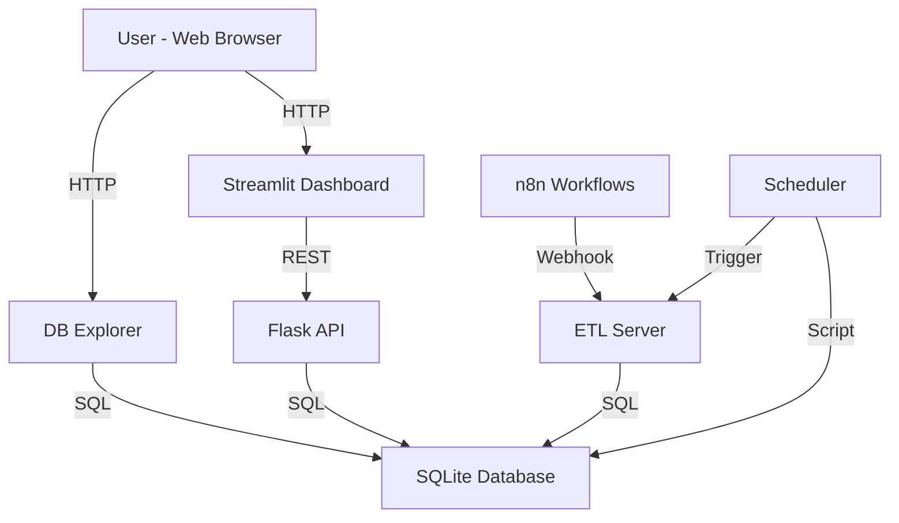
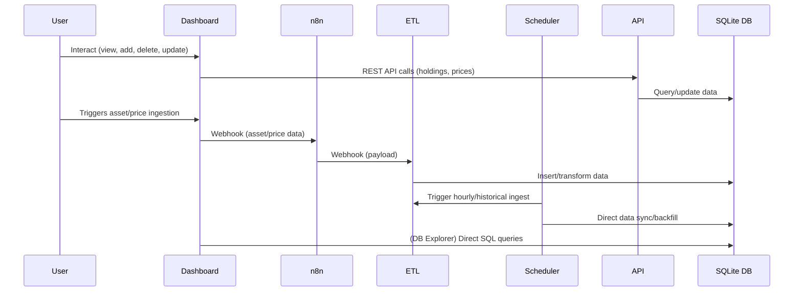

# Financial-Analytics-Pipeline

## Overview
Financial-Analytics-Pipeline is a robust, production-ready, multi-service platform for financial data analytics, portfolio management, and automated data ingestion. It leverages modern Python tools, containerization, and workflow automation to provide a seamless experience for asset tracking, price ingestion, and data exploration.

## Architecture Diagram


## Data Flow Diagram


## Features
- **Streamlit Dashboard**: Interactive dashboard for portfolio and asset management, price/history queries, and data visualization.
- **DB Explorer**: Standalone Streamlit app for safe SQL queries and database exploration.
- **ETL Server**: Automated data ingestion, transformation, and loading from external sources (e.g., n8n workflows).
- **Flask API**: RESTful API for programmatic access to portfolio holdings and price data.
- **n8n Workflows**: No-code/low-code automation for data extraction and integration.
- **Scheduler**: Automated scripts for hourly and historical data backfill.
- **SQLite Database**: Persistent, lightweight storage for all financial data.
- **Dockerized Architecture**: All services run in isolated containers, orchestrated with Docker Compose.
- **CI/CD Ready**: Designed for automated builds, testing, and deployment (e.g., GitHub Actions, Railway.app).

## Architecture
```
financial-analytics-pipeline/
├── dashboard/           # Streamlit dashboard and DB Explorer
├── data/
│   ├── database/        # SQLite database files
│   ├── logs/            # Log files
│   ├── processed/       # Processed data (optional)
│   └── raw/             # ETL scripts and raw data (crypto/stocks ignored)
├── flaskapi/            # Flask API service
├── scheduler/           # Scheduler and backfill scripts
├── Dockerfile*          # Dockerfiles for each service
├── docker-compose.yml   # Multi-service orchestration
└── ...
```

## Services
- **dashboard/**: `app.py` (main dashboard), `db_explorer_app.py` (DB Explorer)
- **flaskapi/**: `db_api_server.py` (REST API)
- **data/raw/**: `etl_server.py` (ETL ingestion), `transform.py`, `extract.py`
- **scheduler/**: `hourly_ingest.py`, `backfill_historical.py`
- **n8n workflows**: JSON files for automation (in `data/n8n workflows/`)

## Setup & Usage

### Prerequisites
- Docker & Docker Compose
- (Optional) Python 3.11+ for local development

### Local Development
1. Clone the repository:
	```sh
	git clone https://github.com/stevenkaranja/Financial-Analytics-Pipeline.git
	cd Financial-Analytics-Pipeline
	```
2. Build and run all services:
	```sh
	docker compose up --build
	```
3. Access the apps:
	- Streamlit Dashboard: [http://localhost:8501](http://localhost:8501)
	- Flask API: [http://localhost:5000](http://localhost:5000)
	- n8n: [http://localhost:5678](http://localhost:5678)

### Database
- SQLite database is stored in `data/database/finance_data.db` and is persisted via Docker volume.
- All assets with price data are auto-synced to `portfolio_holdings`.

### Data Ingestion
- n8n workflows trigger ETL ingestion via webhooks.
- ETL server processes and loads data into the database.
- Scheduler scripts run hourly and for historical backfill.

### Customization
- Add new ETL scripts or workflows as needed in `data/raw/` and `data/n8n workflows/`.
- Update dashboard logic in `dashboard/app.py`.


## Deployment

### CI/CD
This project is fully containerized and integrated with CI/CD using GitHub Actions. Every push to the repository automatically triggers builds, tests, and deployment steps. Docker images for each service are built and pushed to the container registry, and the stack is deployed to Railway.app.

### Railway.app
The project has been deployed to Railway.app using Docker Compose. The GitHub repository is connected to Railway for continuous deployment. Persistent storage and environment variables are configured for production use. All services are orchestrated and run reliably in the cloud.

## Security & Secrets
- Store sensitive credentials as environment variables or Railway secrets.
- Do not commit secrets or API keys to the repository.

## Contributing
Pull requests and issues are welcome! Please open an issue to discuss major changes.

## License
MIT License. See [LICENSE](LICENSE) for details.

## Acknowledgements
- [Streamlit](https://streamlit.io/)
- [Flask](https://flask.palletsprojects.com/)
- [n8n](https://n8n.io/)
- [Railway](https://railway.app/)
- [Docker](https://www.docker.com/)